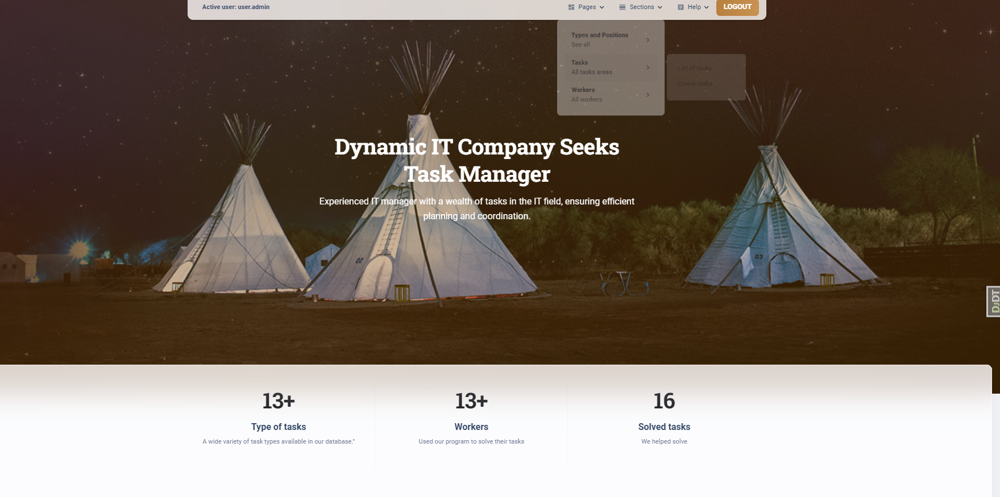
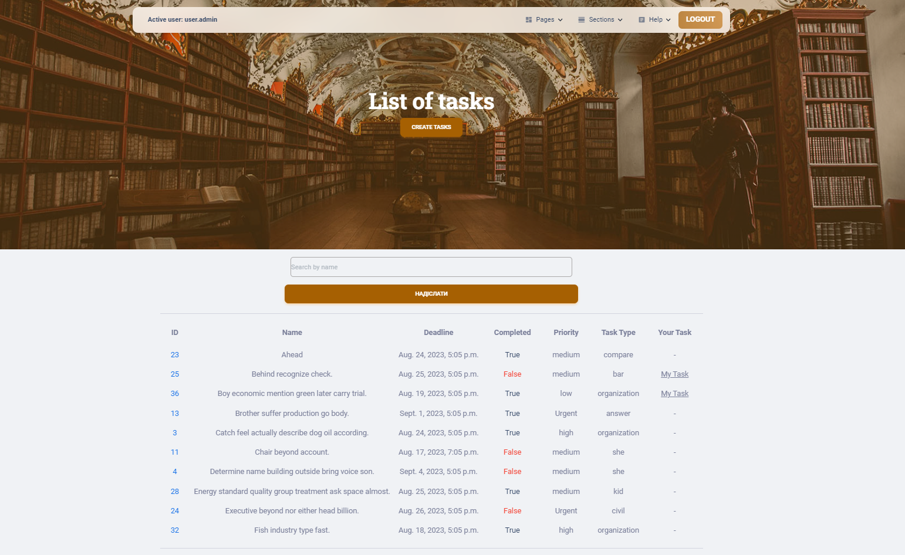
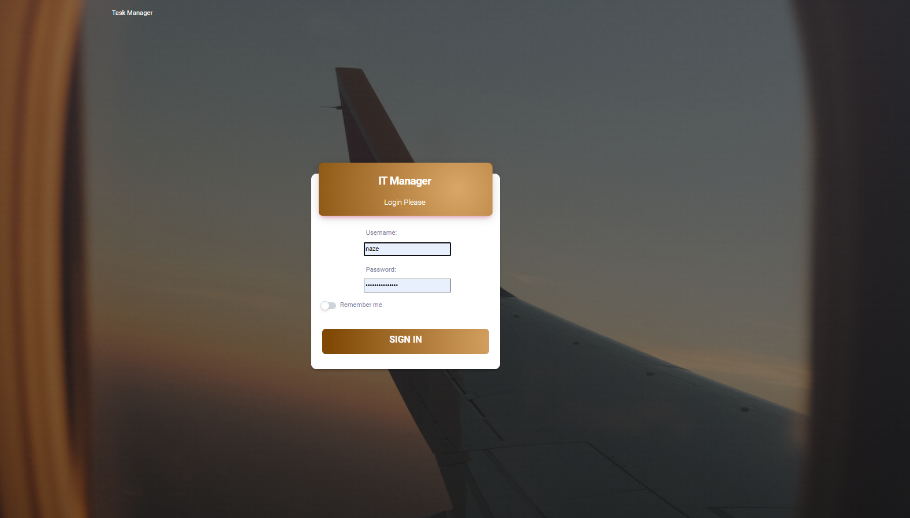

# IT_Company_Task_Manager

Django project for manage tasks in IT company

## Check it out!
[ It Company Task Manager deployed to Render](https://it-company-task-manager-fi9a.onrender.com/)
login: user
password: user12345
## Installation

Python3 must be already installed

```
git clone https://github.com/CeO-PsH/IT_Company_Task_Manager.git
cd IT_manager
python -m venv venv
source venv/bin/activate
pip install -r requirements.txt
python manage.py runserver
```

## Features 

* Authentication functionality for Worker/User
* Managing tasks, worker, position of worker type of tasks directly from website
* Powerful admin panel

# Demo



